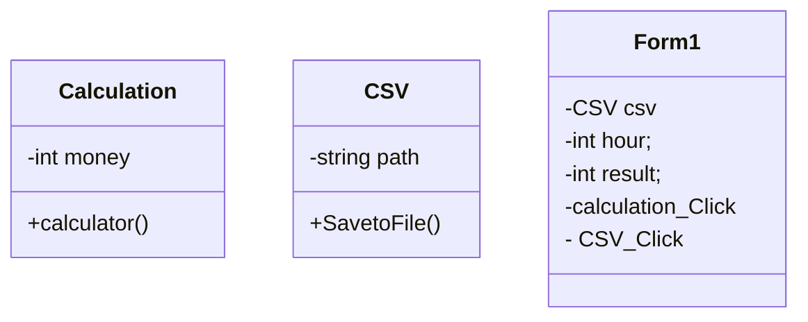

# Final-Project
### ความเป็นมาของโปรแกรม
ถูกสร้างมาเพื่อคำนวลรายได้ของพนักงาน
### วัตถุประสงค์
โปรแกรมถูกแบบให้มาคำนวลค่าแรงในแบบที่ถูกต้องและสะดวกสบายและนำมาใช้งาน
### โครงสร้างของโปรแกรม(Class diagram)

### ชื่อผู้พัฒนาโปรแกรม
นางสาว ณัฐธนาภรณ์ อุ้ยเพชร
รหัสนักศึกษา 663450309-4

